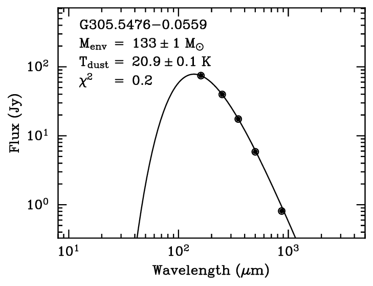

This script is written for fitting multi-band far-IR to
sub-mm fluxes of cores/clumps to modified-blackbodies.

In default, the free parameters are the dust temperature 
and source mass. It the betaVary is set to True, 
the emissivity index (beta) can also be fit. 

Originally written by Jinghua Yuan

Version 0.1  July 4th, 2017

A figure bellow shows an example

